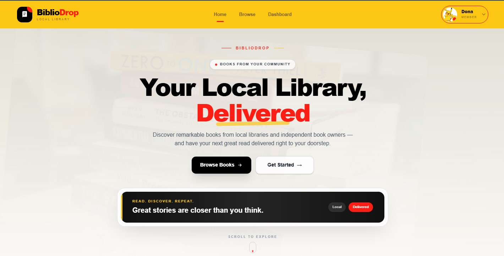
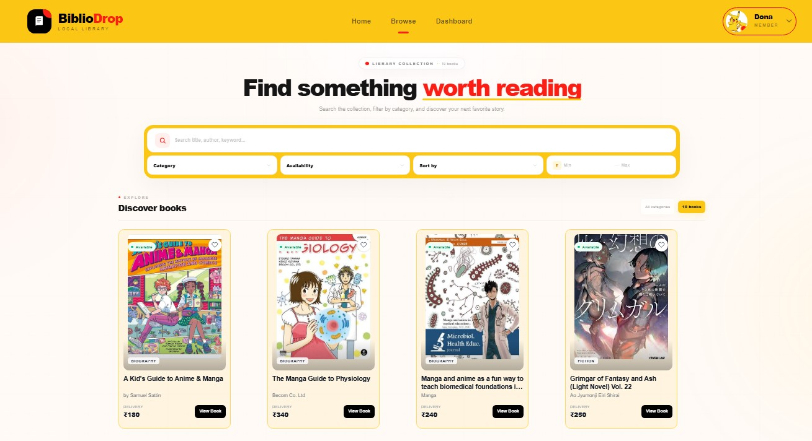
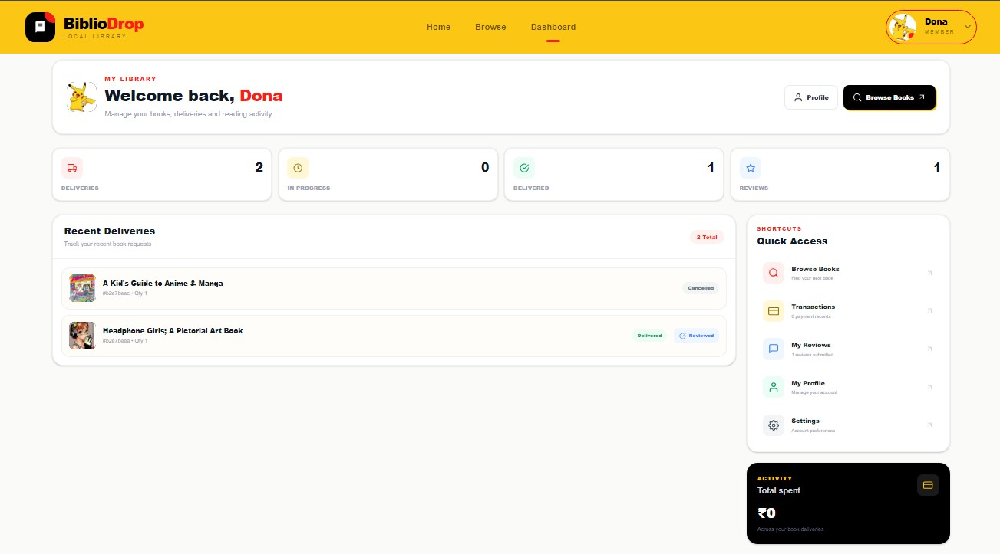
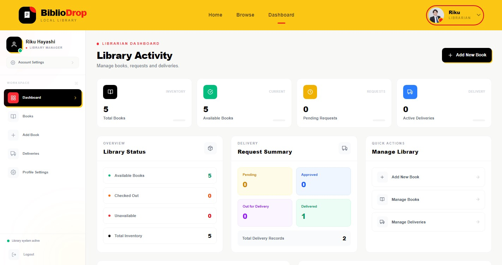
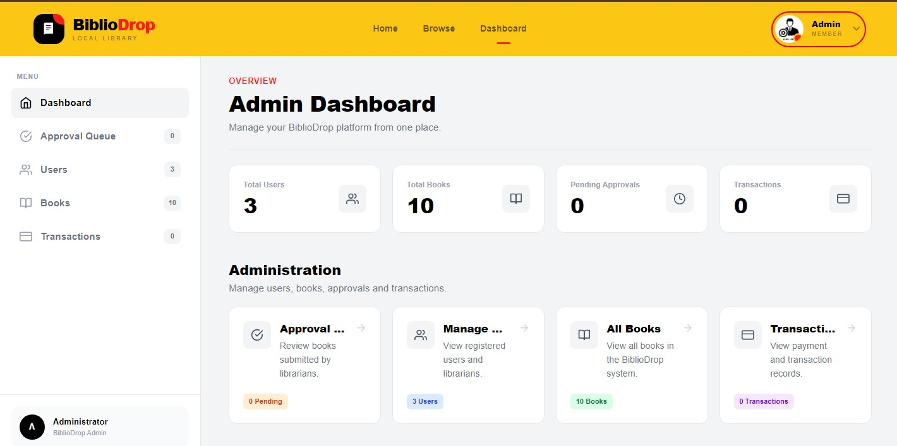

# 📚 BiblioDrop

<p align="center">
  
</p>

<h3 align="center">
  Your Local Library, Delivered 📚
</h3>

<p align="center">
  A modern online book delivery management system connecting readers with local librarians.
</p>

<p align="center">
  <a href="https://bibliodrop-client-seven.vercel.app/">
    
  </a>
  <a href="https://github.com/Nabdip-Dev/bibliodrop-client">
    
  </a>
</p>

---

## 🌐 Live Project

### 🚀 Live Website

**BiblioDrop:**
https://bibliodrop-client-seven.vercel.app/

### 💻 GitHub Repository

**Client Repository:**
https://github.com/Nabdip-Dev/bibliodrop-client

---

## 📖 About BiblioDrop

**BiblioDrop** is an online book delivery management system designed to connect readers with local librarians.

Users can browse available books, view detailed information, request book deliveries, make delivery-fee payments through Stripe, write reviews, and manage their delivery history.

Librarians can manage their books and deliveries, while administrators can manage the overall platform.

---

## ✨ Key Features

### 👤 User

* 🔐 Secure authentication with Better Auth
* 🔑 JWT-protected API access
* 📚 Browse available books
* 🔎 Search and filter books
* 📖 View complete book details
* 🚚 Request book delivery
* 💳 Pay delivery fees using Stripe
* 📦 Track delivery status
* ❌ Cancel pending deliveries
* ⭐ Submit and view book reviews
* 📋 View delivery history
* 👤 Manage profile

### 📚 Librarian

* 🔐 Librarian authentication
* ➕ Add new books
* ✏️ Edit book information
* 🗑️ Delete books
* 📢 Publish/unpublish books
* 📦 Manage delivery requests
* 🔄 Update delivery status
* 📊 View librarian dashboard
* 📚 Manage owned books

### 🛡️ Admin

* 📊 Admin dashboard
* 📚 Manage books
* 👥 Manage users
* 👤 Manage user roles
* ✅ Approve pending books
* ❌ Reject books
* 🗑️ Delete books
* 📈 View platform statistics

---

## 💳 Payment System

BiblioDrop uses **Stripe** for secure delivery-fee payments.

Payment flow:

```text
Book Details
     ↓
Request Delivery
     ↓
Select Quantity
     ↓
Stripe Payment
     ↓
Payment Confirmation
     ↓
Pending Delivery
     ↓
Librarian Processes Delivery
```

The payment system uses Stripe PaymentIntents and Stripe Elements.

---

## 🔐 Authentication & Security

BiblioDrop uses **Better Auth** for authentication and a JWT-based protection layer for backend API routes.

### Authentication

* Email & password authentication
* Google authentication
* Role-based access
* User
* Librarian
* Admin

### API Security

Protected backend routes verify JWT authentication before allowing access.

JWT authentication uses:

```text
Better Auth Session
        ↓
JWT Bootstrap Token
        ↓
Backend JWT Cookie
        ↓
Protected API
```

---

## 🛠️ Technology Stack

### Frontend


* Next.js
* React
* Tailwind CSS
* JavaScript
* Better Auth
* Stripe Elements

### Backend


* Node.js
* Express.js
* MongoDB
* JWT
* Stripe
* CORS

### Deployment

* Frontend: Vercel
* Backend: Render
* Database: MongoDB Atlas
* Payment: Stripe

---

## 🎨 UI Highlights

BiblioDrop uses a modern, colorful interface with:

* 🟡 Yellow primary brand color
* 🔴 Red accent color
* ⚫ Minimal black typography
* 📱 Responsive layouts
* ✨ Smooth transitions
* 🎴 Modern book cards
* 📊 Dashboard interfaces
* 🧩 Role-based navigation
* 📚 Library-inspired visual design

---

## 📸 Screenshots

### 🏠 Homepage

<p align="center">
  
</p>

### 📚 Browse Books & 👤 User Dashboard

<table>
  <tr>
    <td align="center">
      
    </td>
    <td align="center">
      
    </td>
  </tr>
</table>

### 📚 Librarian Dashboard & 🛡️ Admin Dashboard

<table>
  <tr>
    <td align="center">
      
    </td>
    <td align="center">
      
    </td>
  </tr>
</table>

## 📁 Project Structure

```text
bibliodrop-client/
│
├── app/
│   ├── api/
│   │   └── auth/
│   │
│   ├── browse-books/
│   ├── dashboard/
│   │   ├── admin/
│   │   ├── librarian/
│   │   └── user/
│   │
│   ├── login/
│   ├── register/
│   ├── select-role/
│   ├── payment/
│   ├── payment-success/
│   ├── book-details/
│   │
│   ├── home/
│   │   ├── Banner
│   │   ├── Categories
│   │   ├── LatestBooks
│   │   └── TopLibrarians
│   │
│   └── page.jsx
│
├── components/
│   ├── Navbar
│   ├── Footer
│   ├── BookCard
│   └── JwtSync
│
├── lib/
│   ├── auth.js
│   └── auth-client.js
│
├── public/
│   └── banner.png
│
├── .env.local
├── package.json
└── README.md
```

---

## ⚙️ Installation

Clone the repository:

```bash
git clone https://github.com/Nabdip-Dev/bibliodrop-client.git
```

Go to the project directory:

```bash
cd bibliodrop-client
```

Install dependencies:

```bash
npm install
```

Start the development server:

```bash
npm run dev
```

Open:

```text
http://localhost:3000
```

---

## 🔑 Environment Variables

Create a `.env.local` file in the project root.

```env
NEXT_PUBLIC_SERVER=http://localhost:5000

BETTER_AUTH_URL=http://localhost:3000

MONGODB_URI=your_mongodb_connection_string
MONGODB_DATABASE=your_database_name

JWT_SECRET=your_jwt_secret
JWT_EXPIRES_IN=7d

GOOGLE_CLIENT_ID=your_google_client_id
GOOGLE_CLIENT_SECRET=your_google_client_secret

NEXT_PUBLIC_STRIPE_PUBLISHABLE_KEY=your_stripe_publishable_key
```

> Never commit real API keys, database credentials, JWT secrets, or Stripe secret keys to GitHub.

---

## 🔧 Backend Setup

The BiblioDrop frontend communicates with a separate Express backend.

Backend responsibilities include:

* Authentication-protected APIs
* Book management
* Delivery management
* Reviews
* Transactions
* Stripe PaymentIntents
* JWT verification
* Admin operations

Backend production URL:

```text
https://bibliodrop-server-mhw4.onrender.com/
```

---

## 🚀 Production Deployment

### Frontend

The frontend is deployed on **Vercel**.

```text
https://bibliodrop-client-seven.vercel.app/
```

### Backend

The backend is deployed on **Render**.

```text
https://bibliodrop-server-mhw4.onrender.com/
```

### Production Checklist

* ✅ Environment variables configured
* ✅ MongoDB connection configured
* ✅ Better Auth configured
* ✅ Google OAuth configured
* ✅ JWT configured
* ✅ Stripe configured
* ✅ CORS configured
* ✅ Protected API routes
* ✅ Production frontend deployed
* ✅ Production backend deployed
* ✅ Route reload tested
* ✅ Authentication persistence tested

---

## 🔄 Application Flow

```text
                    BIBLIODROP
                        │
        ┌───────────────┼───────────────┐
        │               │               │
      USER          LIBRARIAN          ADMIN
        │               │               │
        ↓               ↓               ↓
 Browse Books      Manage Books     Manage Platform
        │               │               │
 Book Details       Deliveries       Users
        │               │               │
 Request Delivery   Update Status    Books
        │
        ↓
      Stripe
        │
        ↓
 Payment Success
        │
        ↓
 Pending Delivery
        │
        ↓
 Librarian Processing
```

---

## 📦 Main Modules

| Module            | Description                          |
| ----------------- | ------------------------------------ |
| 🔐 Authentication | Better Auth + Google OAuth           |
| 📚 Books          | Browse and manage books              |
| 🚚 Deliveries     | Book delivery management             |
| 💳 Payments       | Stripe PaymentIntent                 |
| ⭐ Reviews         | User book reviews                    |
| 👤 Users          | User account management              |
| 📚 Librarians     | Librarian book & delivery management |
| 🛡️ Admin         | Platform administration              |
| 🔑 JWT            | Protected backend API access         |

---

## 🌟 Future Improvements

Possible future improvements include:

* 🔔 Real-time delivery notifications
* 📍 Delivery location tracking
* 💬 User-librarian messaging
* 📊 Advanced analytics
* ❤️ Wishlist functionality
* 📱 Mobile application
* 📧 Email notifications
* 🔎 Advanced book recommendation system

---

## 👨‍💻 Author

### Nabdip Dev Sharma

**GitHub:**
https://github.com/Nabdip-Dev

**Project:**
https://github.com/Nabdip-Dev/bibliodrop-client

**Live:**
https://bibliodrop-client-seven.vercel.app/

---

<p align="center">
  📚 <strong>BiblioDrop</strong>
  <br />
  Your local library, delivered to your doorstep.
</p>

<p align="center">
  Made with ❤️ using Next.js, MongoDB, Express, Better Auth & Stripe.
</p>
